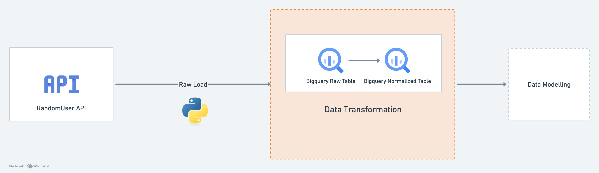

# 📊 Data Engineering Project – ELT Pipeline (BigQuery)

## Overview

This project implements an **end-to-end idempotent ELT pipeline** using:

* **Python** for ingestion & orchestration
* **Google BigQuery** as the data warehouse
* **Randomuser API** as the data source

The pipeline:

1. Ingests raw JSON data from API
2. Stores raw data in BigQuery
3. Transforms data into normalized tables
4. Tracks execution using audit logs and metrics

---

## Architecture



**ELT Approach:**

```
API → Raw (JSON) → BigQuery → Transform (SQL MERGE) → Normalized Tables
```

### Layers

* **Ingestion Layer**

  * Fetch API data
  * Store raw JSON (1 row per API call)

* **Transformation Layer**

  * Flatten JSON using BigQuery SQL
  * Upsert into normalized tables using MERGE

* **Observability Layer**

  * `pipeline_audit_logs`
  * `pipeline_metrics`
  * `metadata_info`

---

## Project Structure

```
config/              → configuration files
infra/               → dataset & table setup (run once)
ingestion/           → API + raw loading
transformations/     → SQL + execution logic
utils/               → shared utilities (BigQuery client, logging, config_loader)
keys/                → service account JSON
main.py              → pipeline entrypoint
```

---

## Prerequisites

Make sure you have the following installed:

* Python 3.11 or higher
* Check your Python version
python3 --version

If your version is below 3.11, upgrade Python before proceeding.

## Setup Instructions

### 1. Clone Repository

```bash
git clone <your-repo-url>
cd tsc-data-engineering-project
```

---

### 2. Create Virtual Environment

```bash
python3 -m venv venv
source venv/bin/activate      # Mac/Linux
venv\Scripts\activate         # Windows
```

---

### 3. Install Dependencies

```bash
pip install -r requirements.txt
```

---

### 4. Add Service Account Key

Place your **BigQuery service account JSON file** inside:

```
keys/service_account.json
```

### 5. Environment Variables Setup

Create a `.env` file in the root directory:

```bash
cp .env.example .env
```

Update the `.env` file with your actual service account path added to keys folder in previous step:

```env
GOOGLE_APPLICATION_CREDENTIALS=keys/service_account.json
```

> ⚠️ This is required for authentication.
> The pipeline uses this key to connect to BigQuery.

---

### 5. Configure Pipeline

Edit:

```
config/config.yml
```

Example:

```yaml
project_id: project_id (from service account file)
dataset: <your_dataset_name>
```

---

## Infrastructure Setup (Run Once)

This creates:

* Dataset
* System tables
* Raw tables
* Audit + metrics + metadata_info tables

```bash
python -m infra.setup
```

---

## Run Pipeline

```bash
python main.py
```

---

## Pipeline Flow

1. **Ingestion**

   * Fetch data from API

2. **Ingestion**

   * Store raw JSON in BigQuery
   * Track via audit logs

3. **Transformation**

   * UNNEST JSON
   * Apply MERGE (upsert)
   * Log metrics

---

## 🧩 Schema Design (Normalized Tables)

The raw JSON from the API contains nested structures, which were normalized into multiple tables to improve clarity, reduce redundancy, and support scalable querying.

### Key Design Choice

* `user_id` (from `$.login.uuid`) is used as the **primary key**
* It acts as a **foreign key across all tables**, ensuring consistent joins

### Table Breakdown

* **`users_user`**
  Core user attributes (name, gender, DOB, nationality)
  → Anchor table at **1 row per user**

* **`users_login`**
  Authentication-related fields (username, password hash, registration date)
  → Separated for logical grouping and sensitivity

* **`users_location`**
  Address and geographic details
  → Flattened from nested `location` object

* **`users_contact`**
  Contact information (email, phone, cell)
  → Isolated for modular access

* **`users_assets`**
  Image URLs (profile pictures)
  → Stored separately as non-analytical data

### Design Principles

* **Normalization** → avoids duplication of nested fields
* **Consistent Grain** → each table has **1 row per user per entity**
* **Separation of Concerns** → logical grouping of attributes
* **Extensibility** → easy to add new attributes without impacting existing tables

---

## Key Design Decisions

### 1. ELT Instead of ETL

* ELT design considered to leverage the potential of data warehouse
* Raw data stored first
* Transformations performed on raw data within BigQuery
* Enables scalability & flexibility

---

### 2. Raw Data Storage (JSON)

* One row per API call
* Preserves full payload
* Enables replay/debugging

---

### 3. MERGE for Idempotency

* Prevents duplicates
* Handles updates cleanly
* Supports incremental processing

---

### 4. Step-Level Logging

* Each step tracked independently
* Enables motinoring and failure detection
---

### 5. Metrics Tracking

* Captures:

  * Rows affected
  * Execution duration
  * Errors

---

### 6. Modular Code Design

* Separation of concerns:

  * ingestion
  * transformation
  * infra
  * utils
* Easily extendable

---


## Error Handling

* API retries implemented
* BigQuery insert errors explicitly handled
* Step-level failure logging
* Pipeline stops on failure

---

## Idempotency

* Achieved using:

  * `MERGE` statements
  * `ingested_at` timestamp tracking
* Re-running pipeline does not duplicate data

---

## Automation Plan (Airflow)

### Approach

This pipeline can be orchestrated using **Apache Airflow**.

---

### DAG Design

Each step becomes a task:

```
ingestion → users → location → login → ...
```

---

### Example DAG Structure

```python
ingestion_task >> users_task >> location_task >> login_task >> contact_task >> assets_task
```

---

### Benefits

* Retry per task
* Failure isolation
* Scheduling (daily/hourly)
* Granular and high level monitoring via Airflow UI
* Easy alert configurations on failure

---

## Future Improvements

* Partition raw table on `ingested_at`
* Add clustering on `user_id`
* Implement transformation and tests using dbt
* Alerting on failures
* CI/CD integration

---

## 👤 Author

Agam
